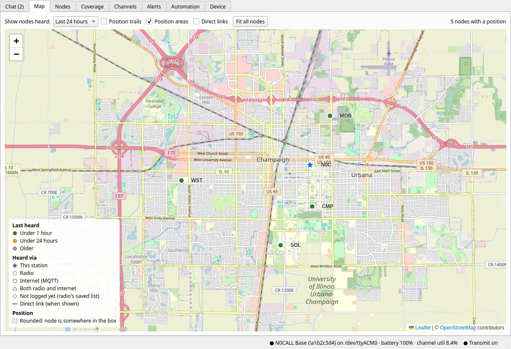
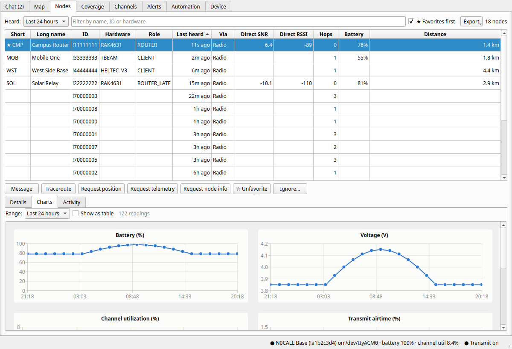
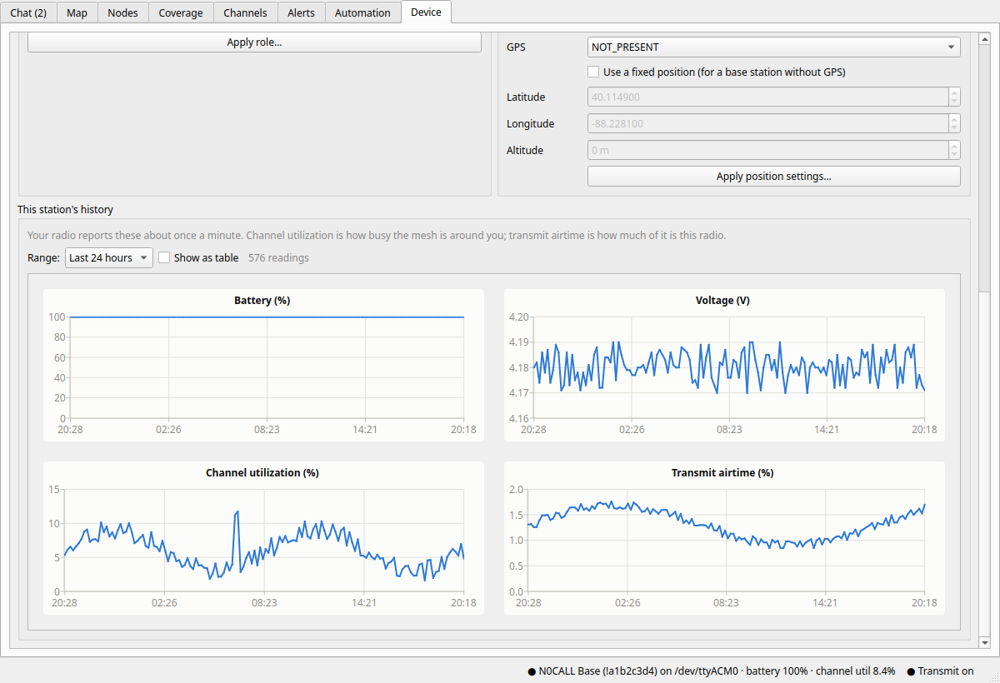
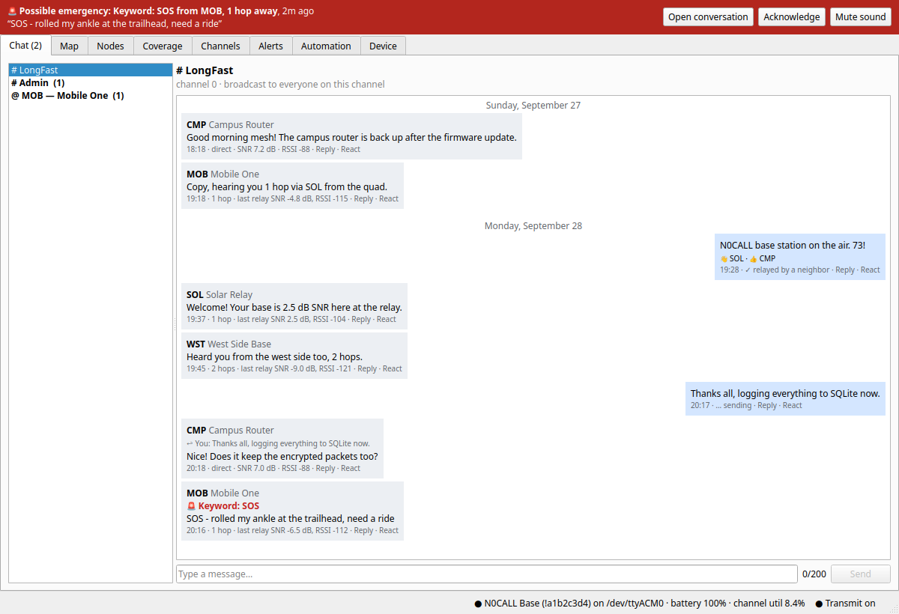
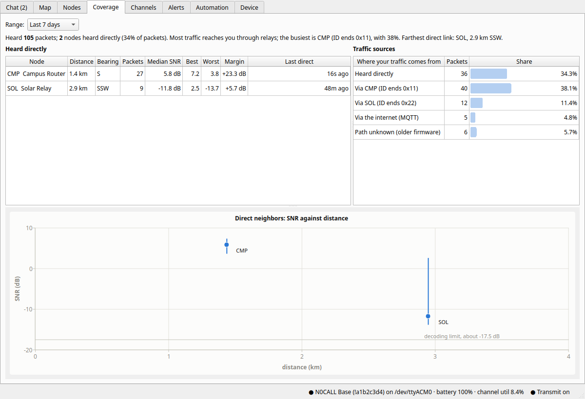

# MeshShack — a desktop station for Meshtastic

[](https://github.com/JLF21-dev/meshshack/actions/workflows/tests.yml)
[](LICENSE)

MeshShack turns a computer with a USB-connected [Meshtastic](https://meshtastic.org)
radio into a station: an always-on logger that records everything the radio
hears, and a desktop app for chat, a live map, node history, channels and
radio settings. It's built to be a good neighbor on a shared mesh: every
transmission goes through an airtime gatekeeper with conservative limits and
a kill switch.



- **Always-on logger:** a systemd service that owns the radio's USB port and
  records every packet (even encrypted ones it can't read), nodes, messages,
  positions and telemetry to SQLite. Reconnects on its own.
- **Desktop app** (system tray): chat with delivery status, a map with honest
  position precision, a node table with direct-signal columns, per-node history
  charts, channel management with QR sharing, and radio settings.
- **Careful with airtime:** budgets per sender, back-off when the channel is
  busy, and a kill switch; see [Airtime](#airtime).
- **API for other apps:** read endpoints, a live event stream, and scoped,
  revocable tokens; see [API for other apps](#api-for-other-apps).
- **Coverage analysis:** who you hear directly (distance, bearing, SNR, link
  margin), and which relays bring you everything else, from what's already
  logged. Useful for siting a node.
- **Emergency alerts:** SOS, MAYDAY and other keywords, Meshtastic alert
  messages and the alert bell raise a banner, an alarm and a notification
  (detected by the logger, even while the app is closed). Nothing is sent.
- **Automation:** your own scheduled messages (e.g. a weekly NIST time check
  or a daily weather report), filled in from data sources and HTTP/JSON
  APIs, strictly rate-limited, and dry runs until you go live.
- **Export:** nodes (CSV/KML), messages and telemetry (CSV), position history (GPX).

Status: 0.1, in daily use on a Heltec V4 (firmware 2.7) on Linux. Plans and the
backlog are in [ROADMAP.md](ROADMAP.md).

| Nodes, with a node's history | This station's channel load |
|---|---|
|  |  |
| **Chat** | **Coverage** |
|  |  |

The screenshots come from `dev/demo_gui.py`, which fills a demo database with
made-up nodes.

## How it fits together

```
 Heltec (USB) ── meshshack run ──> SQLite database <── meshshack gui (reads)
                      │                                   │
                      └── localhost API (127.0.0.1:8765) <┘ (sends, device commands)
```

Only one program can hold the USB port, so `meshshack run` is the hub: it owns
the radio, logs everything, and serves a small API bound to 127.0.0.1. The
app reads the database directly and sends messages and commands through the
API. The API's token is in `hub.json` next to the database (readable only by
you) and changes each time the logger starts.


## Setup

```bash
git clone https://github.com/JLF21-dev/meshshack.git
cd meshshack
python3 -m venv .venv
.venv/bin/pip install -e '.[dev,gui]'    # drop ",gui" for a headless logger
```

Linux only lets members of the `dialout` group open serial ports:

```bash
sudo usermod -aG dialout $USER    # then log out and back in
```

Plug in the radio and check that a port appears: `ls /dev/ttyACM* /dev/ttyUSB*`.
ESP32-S3 boards like the Heltec V3/V4 show up as `/dev/ttyACM0`. If nothing
appears, try another USB cable, since many are power-only.

## Usage

```bash
.venv/bin/meshshack run                     # auto-detect the radio and log until Ctrl-C
.venv/bin/meshshack run --port /dev/ttyACM0 # or name the port

.venv/bin/meshshack nodes --since 24h       # who's been heard, with SNR/RSSI/hops/battery
.venv/bin/meshshack messages -n 20          # recent text messages
.venv/bin/meshshack packets --type POSITION_APP
.venv/bin/meshshack packets --json -n 5     # full packet contents
.venv/bin/meshshack telemetry --kind deviceMetrics
.venv/bin/meshshack stats --since 7d        # packet counts by type
.venv/bin/meshshack events                  # connect/disconnect history
.venv/bin/meshshack coverage --since 7d  # direct neighbors and where traffic comes from
.venv/bin/meshshack alerts               # open emergency alerts (--all for history; ack ID|all)
.venv/bin/meshshack automation           # scheduled message jobs and recent runs
.venv/bin/meshshack export nodes -f kml -o nodes.kml          # also csv
.venv/bin/meshshack export positions --since 7d -o tracks.gpx
.venv/bin/meshshack export messages -o messages.csv           # telemetry too
```

The database defaults to `~/.local/share/meshshack/meshshack.db`; override it with
`--db PATH` or the `MESHSHACK_DB` environment variable. Query commands can run
while the logger is running.

Only one program can hold the USB port at a time. While `meshshack run` is
connected, use the phone app over Bluetooth, not USB tools like the
`meshtastic` CLI.

## Desktop app

The logger runs as a service (below), so the app is only a window onto
it. Open it from the app menu ("MeshShack"), or run `.venv/bin/meshshack gui`.
Starting it again while it's running just brings the window back.

**Tray:** the app lives in the system tray (on Ubuntu's GNOME this needs the
AppIndicator extension, which is on by default). Closing the window hides it
there; left-click the icon to bring it back. The icon shows the unread count,
a red bar when transmitting is off, and turns grey when the radio isn't
connected. A notification pops up when a message arrives while the window
is hidden. The tray menu has the transmit switch, and "Quit" quits the app.
The logger keeps recording either way.

**Start at login:** the tray app runs as a systemd user service tied to your
desktop session. It starts in the tray when you log in, is **restarted
automatically if it ever crashes**, and stays quit when you choose Quit:

```bash
# run from the meshshack folder; fills in where it's installed
sed "s#@MESHSHACK_DIR@#$PWD#g" desktop/meshshack.desktop > ~/.local/share/applications/meshshack.desktop
sed "s#@MESHSHACK_DIR@#$PWD#g" systemd/meshshack-tray.service > ~/.config/systemd/user/meshshack-tray.service
systemctl --user daemon-reload
systemctl --user enable --now meshshack-tray
```

The app logs to `~/.local/state/meshshack/gui.log`: Qt warnings, uncaught
errors (which are logged and don't end the app), and its start and exit. A
crash's stack trace goes to `gui-crash.log` beside it.

- **Chat:** your radio's channels and direct-message conversations with
  unread counts. A conversation with unread messages opens with the last one
  you'd read at the top and a "New messages" line above the rest; otherwise
  it opens at the newest. New arrivals keep you at the bottom if you're
  there, and don't move you if you've scrolled up. Every message has
  **Reply** and **React** links: a reply quotes the message it answers, and
  reactions (tapbacks) appear under the message they're for, grouped by
  emoji. Both are ordinary small messages, so they go through the airtime
  gatekeeper like any other send. Messages show hops and,
  for messages heard directly, SNR and RSSI. Your sent messages show
  delivery status: `…` sending, `✓` relayed by a neighbor, `✓✓` delivered
  (direct messages only), `✗` failed. The send box counts bytes against
  the 200-byte limit.
- **Map:** nodes with a position on OpenStreetMap. Color is when a node was
  last heard; shape is how its traffic reaches you (circle radio, square
  internet/MQTT, triangle both, diamond not logged yet, star this station).
  Most channels share positions rounded to a grid cell (LongFast's default
  is about 5.8 × 4.4 km), so a rounded position is drawn with a dashed box
  showing the area the node could be anywhere in, and nodes rounded to the
  same point are fanned out around it. Your own station is drawn at the
  exact fixed position you set, not the rounded one it broadcasts.
  Optional position trails. Click a node to message it, traceroute it, or
  request its position.
- **Nodes:** sortable table: last heard, how it's heard (radio, internet,
  or both), direct SNR/RSSI, hops, battery, and distance from you (≈ when a
  position is rounded). SNR and RSSI only come from packets heard straight
  from the node; a relayed packet's signal belongs to the last relay, and an
  MQTT packet's to the gateway, so those are left blank. Actions: message,
  traceroute, request position, telemetry or node info, and **★ Favorite**
  or **Ignore**. Both are stored on your radio and nothing is transmitted.
  With the CLIENT_BASE role, favorites get router priority; ignored nodes'
  packets are dropped by the radio (so not logged either). "★ Favorites
  first" keeps favorites at the top of any sort. Below the table:
  - **Details:** everything known about the selected node: when it was
    heard (at all, over the radio, directly), its direct signal, position
    and how precise it is, packets logged by type, and its last traceroute.
  - **Charts:** its history, one measure per chart: battery, voltage,
    channel utilization, transmit airtime (from its device telemetry), and
    direct SNR. Hover for the exact time and value; "Show as table" lists
    the readings. Long ranges are averaged to keep it quick.
  - **Activity:** traceroutes and requests with their results. The logger
    matches replies even while the app is closed.
  - **Export:** nodes (CSV or KML), messages, telemetry (CSV), or position
    history (GPX), for the time range picked under "Heard". The same is
    available as `meshshack export` (below).
- **Coverage:** how this station hears the mesh, from the log alone (nothing
  is transmitted):
  - **Heard directly:** every node heard straight from the source (0 hops,
    not MQTT), with distance and compass bearing from you (a range when its
    position is rounded), packets, median/best/worst SNR, and **link
    margin**: the median SNR above the lowest SNR your modem preset can
    decode (about −17.5 dB for LongFast). A few dB is a fragile link.
  - **Traffic sources:** what share of everything you hear arrived directly,
    through each relaying neighbor, via MQTT, or by an unknown path. The
    firmware records only the last byte of a relay's ID, so relays are
    matched to nodes you hear directly by that byte ("?" marks a guess).
  - **SNR against distance** for direct neighbors: the median SNR, a bar for
    the best-to-worst spread, a dashed bar for the distance range of a
    rounded position, and a line at the decoding limit.
  - On the **Map**, "Direct links" draws a line to each direct neighbor.
  The same report is `meshshack coverage` and `GET /api/coverage`.
- **Alerts:** possible emergencies. The logger checks every message it
  hears, so it works while the app is closed, and flags:
  - Meshtastic **alert messages** (the ALERT_APP message type);
  - the **alert bell** (the BEL character the Meshtastic apps' alert
    button sends);
  - **keywords**, as whole words in any case (SOS, MAYDAY, EMERGENCY,
    HELP ME and 911 by default; editable);
  - optionally, detection-sensor messages (off by default).

  A flagged message shows a red banner above every tab (*Open
  conversation*, *Acknowledge*, *Mute sound*), plays an alarm until it's
  acknowledged, brings the window to the front, pops up a notification,
  and puts a warning on the tray icon. The message itself is marked in
  chat. Alerts heard only via MQTT are recorded quietly unless you turn
  them on. **Test alert** checks the banner and sound. MeshShack never
  sends anything in response. `meshshack alerts` lists them
  (`meshshack alerts ack all`).
- **Automation:** messages you define, sent on a schedule (daily, weekly,
  or every N hours, at least 6), with content filled in when they run. The
  logger runs them, so they work with the app closed.
  - **Templates** with placeholders: `{time}`, `{date}`, `{time_utc}`;
    `{clock.offset_ms:+.0f}` (this computer's clock checked against NIST's
    time servers); station stats like `{station.nodes_heard_7d}` or
    `{station.channel_util:.0f}`; node values like `{node.CMP.battery}`;
    `{weather.short}`, `{weather.temp}` and friends from the US National
    Weather Service for your station's area (your position is rounded to
    about 1 km before it's sent); fields from **any HTTP/JSON API** you add
    as a data source (`{aq.pm25}` for a field picked by path such as
    `current.pm25`); and, if you allow it, a local command's output.
  - **Presets:** weekly NIST time check, daily weather, weekly mesh stats.
  - **Preview** fills a message in with live data and shows its length,
    without sending.
  - **Safety:** new jobs are **dry runs** that record what they would have
    sent; **Go live** asks first. Every send goes through the gatekeeper
    (each job at most every 6 hours, 4 automated sends a day in total, 30 s
    apart, paused above 20% channel utilization, never with transmitting
    off). Runs start a few random minutes after their time so bots don't
    all fire at once. A message over 200 bytes, or with data that couldn't
    be fetched, is skipped, never truncated or sent half-filled; a run the
    logger missed isn't sent late; nothing is retried. The run log says what
    was sent, dry-run, skipped or missed, and why. Nothing replies to
    incoming messages.
  `meshshack automation` lists jobs and runs.
- **Channels:** your radio's channels, with encryption (default public key,
  private AES-128/256 key, or none) and position sharing. Add a private
  channel with a fresh random key, edit a secondary channel, delete one, or
  **Share** it as a QR code or link that adds just that channel (with the
  LoRa settings it needs) to another node; scan it in the Meshtastic app. The
  primary channel's name and key are locked, since they're what put you on
  the public mesh, but its position sharing can be changed: it sets how
  precisely your location is shared (e.g. 13 bits is about a 5.8 × 4.4 km
  area; 0 shares none). Keys are only shown to the app itself, never to API
  tokens, and every change is a config write through the gatekeeper.
- **Device:** at the bottom, **this station's history**: your radio reports
  channel utilization, transmit airtime, battery and voltage about once a
  minute, so you can watch how busy the mesh is around you (with the 25%
  line where the firmware starts holding back).
- **Device:** radio status (firmware, region, preset, battery, channel
  utilization, channels), reboot, announce node info, and settings for owner
  name, role and position (broadcast interval, smart broadcast, GPS mode,
  fixed position). Each change asks for confirmation first. Region, modem
  preset and channel editing are deliberately left out for now.

Renaming the node keeps licensed (ham) mode as it was; the Meshtastic
library's `setOwner()` would otherwise turn it off.

Without the logger running, the app still shows everything logged so far;
sending and device controls come back once `meshshack run` is up.

## Airtime

The mesh is shared, and anything sent can be repeated by many other nodes,
so MeshShack is deliberately conservative. Every transmission, from the app,
the API or (later) automations, goes through one gatekeeper in the logger
(`meshshack/airtime.py`). That includes config changes, because they reboot
the radio and a rebooting radio re-announces itself. The gatekeeper allows or
refuses each send and logs the decision.

- **Kill switch:** the "Transmit" button in the app's status bar, or
  `meshshack tx off` / `meshshack tx on`. When it's off, nothing is sent,
  including config changes. It stays off across restarts.
  `meshshack tx` shows the switch and a log of every send decision.
- **Cost:** a direct message or a request is 1 credit. A channel broadcast,
  traceroute, node announcement or config change is 3, because they're
  flooded or repeated.
- **You, in the app:** at most 5 sends a minute. Traceroutes at least 3
  minutes apart and at most 6 an hour. Above 25% channel utilization you
  get a warning (the firmware itself holds back from there), but nothing is
  refused.
- **Other apps (API):** 6 credits an hour each. No broadcasts unless
  allowed, no config changes, and a node traced at most once every 3 hours.
- **Automations:** each job at most once every 6 hours, and at most 4
  automated sends a day in total.
- **Anything unattended:** sends at least 30 seconds apart, and paused while
  channel utilization is over 20% or this radio's own transmit airtime is
  over 5%. MeshShack never re-sends anything itself.
- **Local settings** (favorite or ignore a node) aren't transmissions: they
  change a list on your radio only, so they're logged at no cost and work
  even with transmitting off. Only the app can make them.

Where these numbers come from: the firmware holds back its own sends above
25% channel utilization. Meshtastic's developers asked a busy app to space
traceroutes 3 minutes apart and 3 hours per node after its automatic
traceroutes pushed a 100-node mesh past 40% utilization
([firmware #6173](https://github.com/meshtastic/firmware/issues/6173),
[MeshSense #64](https://github.com/Affirmatech/MeshSense/issues/64)).
[MeshMonitor](https://meshmonitor.org/features/automation.html) recommends
6–12 hours for automatic announcements and 30 seconds between queued
messages. Community guides keep the hop limit at 3
([SoCal Mesh](https://socalmesh.org/help/best-practices/)). They also note
that routine position, telemetry and node-info broadcasts far outweigh chat
([NEPAMesh](https://nepamesh.com/recommended-node-settings-stop-your-node-from-being-that-node/)),
so a fixed station's own broadcast intervals matter most of all.

## API for other apps

The logger serves a small HTTP API on `http://127.0.0.1:8765`, reachable
only from this machine. The desktop app uses it with the token in
`hub.json`, and it's the only caller that can change the radio's settings
or flip the transmit switch. Other apps get their own tokens:

```bash
.venv/bin/meshshack token create weather-display          # read only
.venv/bin/meshshack token create pager --send             # read + direct messages
.venv/bin/meshshack token create bulletin --send --allow-broadcast
.venv/bin/meshshack token                                 # list, with last use
.venv/bin/meshshack token revoke pager
```

A token is shown once; only its hash is stored. Send it as
`Authorization: Bearer <token>`. Every send from a token goes through the
airtime gatekeeper with its own budget (see [Airtime](#airtime)).

| Endpoint | Scope | What it does |
|----------|-------|--------------|
| `GET /api/status` | read | Radio, LoRa settings, channels, battery |
| `GET /api/nodes?since=24h` | read | Nodes, with `via` (radio, mqtt, both, unknown) |
| `GET /api/messages?since=&channel=&peer=` | read | Text messages; a channel or a DM peer gives that conversation |
| `GET /api/packets?since=&type=&node=` | read | Raw packets, fully decoded |
| `GET /api/telemetry?since=&kind=&node=` | read | Telemetry reports |
| `GET /api/positions?since=&node=` | read | Position history |
| `GET /api/requests` | read | Traceroutes and requests, with replies |
| `GET /api/coverage?since=` | read | Direct neighbors (distance, bearing, SNR, margin) and traffic sources |
| `GET /api/alerts?open=1` | read | Emergency alerts (also streamed as `alert` events) |
| `GET /api/tx` | read | Transmit switch and recent send decisions |
| `GET /api/events` | read | Live stream (server-sent events): `packet`, `message`, `alert`, `connection` |
| `POST /api/send` `{text, to \| channel}` | send | Direct message, or a channel broadcast if the token allows broadcasts |
| `POST /api/traceroute` `{to}` | send | Traceroute (spaced 3 min apart; a node at most every 3 h) |
| `POST /api/request` `{to, what}` | send | Ask a node for `position`, `telemetry` or `nodeinfo` |
| `POST /api/announce` | send | Broadcast this node's info (needs broadcast permission) |
| `POST /api/tx`, `/api/reboot`, `/api/config/*` | app only | Kill switch, reboot, owner/role/position |
| `POST /api/alerts/ack` `{ids \| all}` | app only | Acknowledge alerts |
| `GET /api/automation`, `POST /api/automation/{save,preview,delete,settings}` | app only | Automation jobs |

`since` takes a unix time or a duration like `30m`, `24h`, `7d`; `limit`
caps rows (at most 1000). Nodes can be given as `!a1b2c3d4` or a number.
Refused sends come back as HTTP 429 (budget, spacing, busy channel) or 403
(not allowed, or transmitting is off), with the reason in `error`.

```bash
TOKEN=mst_...   # from `meshshack token create`
curl -H "Authorization: Bearer $TOKEN" 'http://127.0.0.1:8765/api/nodes?since=1h'
curl -N -H "Authorization: Bearer $TOKEN" http://127.0.0.1:8765/api/events
```

## Run as a service

```bash
mkdir -p ~/.config/systemd/user
sed "s#@MESHSHACK_DIR@#$PWD#g" systemd/meshshack.service > ~/.config/systemd/user/meshshack.service
systemctl --user daemon-reload
systemctl --user enable --now meshshack
journalctl --user -u meshshack -f           # live log
loginctl enable-linger $USER               # start at boot, keep running when logged out
```

The service restarts on its own if it ever exits, and reconnects whenever
the radio is unplugged or reboots.

## Database

| Table | Contents |
|-------|----------|
| `nodes` | One row per node: names, hardware, role, last heard, last SNR/RSSI, hops away, last position, battery |
| `packets` | Every packet received, with signal info and the full decoded packet as JSON |
| `messages` | Text messages (channel and direct) |
| `positions` | Position reports |
| `telemetry` | Telemetry reports; `kind` is e.g. `deviceMetrics`, `environmentMetrics`, `localStats`; `metrics` is JSON |
| `messages` (sent) | Your sent messages have `direction = 'out'` and a `status`: sending / relayed / delivered / failed (reason in `status_detail`) |
| `events` | Logger start/stop, connects, disconnects, errors, commands sent from the app |

Times are Unix timestamps (`logged_at` is when the logger received the packet).
Ad-hoc queries work with `sqlite3`, e.g.:

```sql
SELECT datetime(logged_at, 'unixepoch', 'localtime'), json_extract(metrics, '$.batteryLevel')
FROM telemetry WHERE from_num = 0xa1b2c3d4 AND kind = 'deviceMetrics';
```

## Tests

```bash
.venv/bin/pytest
```

The tests build real Meshtastic protobuf packets and pass them through the
library's own decoding code, drive the API against a fake radio, and open the
desktop app offscreen, so no radio or display is needed.

## Contributing

Issues and pull requests are welcome. Two ground rules:

- **Anything that can transmit goes through the gatekeeper** (`meshshack/airtime.py`),
  and new automatic sending needs a strong reason, a dry run, and a hard minimum
  interval. No auto-replies to incoming messages. See [ROADMAP.md](ROADMAP.md).
- Run `pytest` before sending changes. The tests need no radio and no display.

## License

GNU General Public License v3.0 or later; see [LICENSE](LICENSE). Bundled
third-party code (Leaflet, BSD-2-Clause) and map data attribution are listed
in [NOTICES.md](NOTICES.md).
